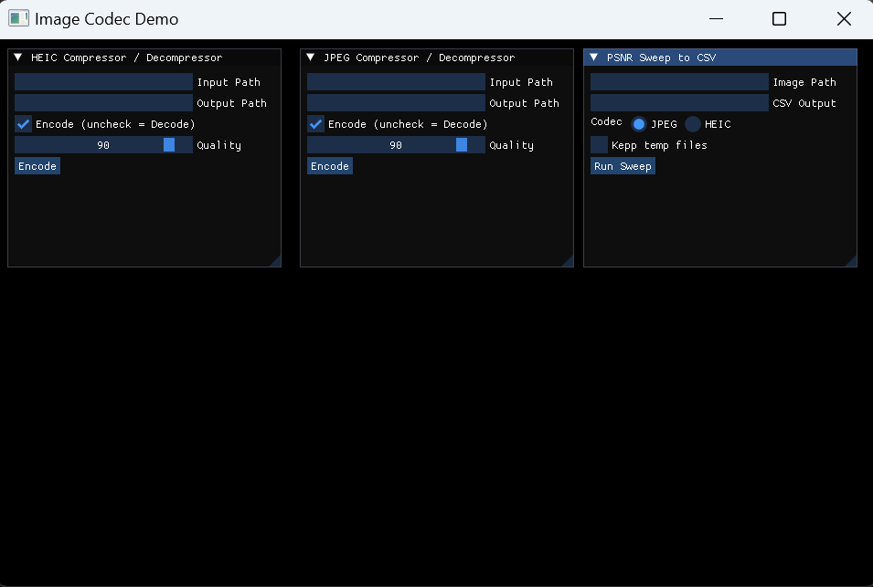
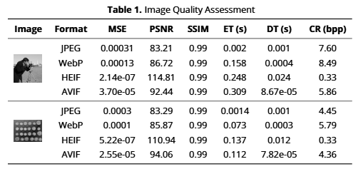

# Datenkompression - HEIC vs JPEG 
## Autoren
1. Roman Kobets
2. Felix Wagner
## Einleitung
Dieses Projekt beschäftigt sich mit der Visualisierung der Qualitätsunterschiede zwischen HEIC und JPEG. 
Benötigt wird für jeden Kompressionsalgorithmus der PSNR-Wert pro Qualitätswert und Dateigröße. Dementsprechend bietet das hier entstandene Programm
Klassen zur JPEG-Komprimierung und HEIC-Komprimierung, eine UI zur Bedienung diesee Klassen, eine csv-Ausgabe der benötigten Daten. Ein Jupiter-Notebook
ermöglicht es diese Daten einzulesen und zu plotten.
## Codedokumentation
### 1. gui.h
Bietet die Grundstruktur für die UI.
### 2. heic.h
Diese Header-Datei bietet eine C++-Implementierung zur Komprimierung und Dekomprimierung von Bildern im HEIC-Format.
Die HEIC-Kodierung basiert auf libheif, einer modernen C-Bibliothek zur Handhabung von HEIC/HEIF-Dateien, die wiederum auf HEVC (H.265) aufbaut. Für die Bildvorverarbeitung und Ausgabe werden stb_image und stb_image_write verwendet.
#### HeicEncoder: 
Die Klasse HeicEncoder übernimmt die Umwandlung eines beliebigen Eingabebildes (z. B. PNG oder JPEG) in eine HEIC-Datei. Dazu wird das Bild zunächst mit stbi_load in ein RGB-Bild mit drei Kanälen geladen. Anschließend wird eine neue HEIC-Image-Struktur erzeugt, in die die RGB-Daten direkt kopiert werden.
Die Kompression erfolgt mit dem in libheif integrierten HEVC-Encoder, dem ein Qualitätswert zwischen 0 (sehr stark komprimiert, geringe Qualität) und 100 (nahezu verlustfrei) übergeben wird. Die resultierende HEIC-Datei wird dann entweder unter dem angegebenen Pfad oder automatisch unter einem generierten Standardnamen gespeichert. Der Encoder funktioniert unabhängig von Transparenzinformationen, da HEIC in diesem Fall nur RGB speichert (kein Alpha).
#### HeicDecoder:
Die Klasse HeicDecoder ermöglicht die Rückkonvertierung von HEIC-Dateien in PNG-Dateien. Hierzu wird eine HEIC-Datei eingelesen, dekodiert und wieder in ein RGB-Format gebracht. Diese RGB-Daten werden anschließend mit Hilfe von stb_image_write als PNG gespeichert. Dies ist vor allem für die anschließende PSNR-Berechnung und visuelle Überprüfung der Bildqualität wichtig.
#### Qualitätssweep und Benchmark
Die Methode evaluateHeicQualitySweep nimmt ein Originalbild (z. B. PNG) entgegen und kodiert es mehrfach in HEIC-Dateien bei verschiedenen Qualitätsstufen. Jede dieser Dateien wird anschließend wieder dekodiert, und das resultierende Bild wird mit dem Originalbild verglichen. Zur Bewertung der Bildqualität wird der PSNR-Wert verwendet, der angibt, wie stark das dekomprimierte Bild vom Original abweicht – höhere Werte entsprechen besserer Qualität. Zusätzlich wird die Dateigröße jeder HEIC-Datei mit std::filesystem::file_size ermittelt.
Alle Ergebnisse werden in eine CSV-Datei geschrieben, typischerweise unter dem Namen heic_quality.csv. Dort sind pro Zeile jeweils die Qualitätsstufe, der PSNR-Wert in Dezibel und die resultierende Dateigröße in Byte eingetragen.
Zur Steuerung des Ablaufs erlaubt die Funktion optionale Parameter:
- Der Pfad zur CSV-Datei
- Eine Liste gewünschter Qualitätsstufen
- Die Option, temporäre HEIC- und PNG-Dateien nach dem Testlauf zu behalten oder zu löschen (praktisch zur Fehleranalyse oder Weiterverarbeitung)
### 3. jpg.h
Die Datei bietet zwei zentralen Komponenten:
Die Klasse JpgEncoder ist für die JPEG-Kompression zuständig. 
Beim Laden eines Bildes über stb_image wird es mit vier Kanälen (RGBA) eingelesen. Um die Transparenz sinnvoll in ein RGB-JPEG zu überführen, 
wird eine Alpha-Maske angewendet: Pixel mit einem Alpha-Wert kleiner als 150 werden als vollständig transparent interpretiert und auf Weiß 
gesetzt (255, 255, 255), während alle anderen Pixel ihre Farbe behalten. Das vorbereitete RGB-Bild wird dann mit Hilfe von libjpeg-turbo in das 
JPEG-Format überführt, wobei der Kompressionsfaktor (Qualität) frei wählbar ist. Das Ergebnis wird in eine Zieldatei geschrieben.<br>
Die Klasse JpgDecoder übernimmt die Rückwandlung der JPEG-Datei in ein RGB-Bild. Dazu wird zunächst der Bild-Header analysiert, um Breite, 
Höhe und Farbraum zu bestimmen, anschließend werden die komprimierten Bilddaten dekodiert. Die Bilddaten stehen danach im RGB-Format zur Verfügung.<br>
Die Funktion JpegPSNRtoCSV führt die Qualitätsanalyse durch. Zunächst wird das Originalbild geladen und als Referenz verwendet. 
Für jede angegebene Qualitätsstufe wird das Bild neu komprimiert und wieder dekodiert. Anschließend wird mit der Hilfsfunktion computePSNR der 
PSNR-Wert zwischen Original und dekomprimiertem Bild berechnet – ein Maß für die Verzerrung durch Kompression. Zusätzlich wird die Größe der 
komprimierten Datei in Byte ermittelt. Die Ergebnisse (Qualität, PSNR, Dateigröße) werden gesammelt und am Ende in eine CSV-Datei geschrieben. 
Optional kann gesteuert werden, ob temporäre JPEG-Dateien während des Vorgangs behalten oder gelöscht werden sollen.

### 4. helpers.h
Beherbergt eine Methode: computePSNR(), die zwei Bilder (Original und dekodiert) vergleicht, welche als flache Arrays
von RGB-Werten (je 8 Bit pro Kanal) vorliegen. Sie berechnet den mittleren quadratischen Fehler (MSE)
über alle Farbkanäle hinweg und leitet daraus den PSNR-Wert in Dezibel (dB) ab.

## Nutzerhandbuch

### Installation
1. WSL (Windows Subsystem Linux) Installieren
2. Build Umgebung einrichten
    ```bash
    sudo apt update
    sudo apt install build-essential cmake ninja-build git \
                    g++-mingw-w64-x86-64 \
                    pkg-config autoconf automake libtool
    ```

3. Repository klonen, aus den Source bauen (mit Debugging)
    ```bash
    git clone https://github.com/felixdeWWWW/compressed_gui.git
    cd compressed_gui

    cmake -B build -G Ninja \
        -DCMAKE_TOOLCHAIN_FILE=mingw-toolchain.cmake \
        -DCMAKE_BUILD_TYPE=Debug
    cmake --build build -j
    ```
### Nutzeroberfläche
`gui.h` packt die gesamte Oberfläche in eine einzige Funktion `run_gui()`. Sie ruft drei kleine Fenster auf – für HEIC-Encode/Decode, JPEG-Encode/Decode und den PSNR-Sweep – und hält sie in einer Schleife am Leben, bis der Nutzer das Hauptfenster schließt.

#### Warum ImGui?

* **Sofort benutzbar**: ImGui ist ein “Immediate Mode-GUI”. Alle Widgets werden jedes Frame neu beschrieben. Kein kompliziertes Ereignis­system, keine XML-Lay­outs – einfach in C++ pro Frame Buttons, Slider, Checkboxen aufrufen, fertig.
* **Debug-Charakter**: Perfekt für Tools, bei denen Bedien­barkeit wichtiger ist als Corporate-Design.
* **Einfach erweiterbar**: Ein neues Codec-Fenster? Zwei Zeilen Code.

#### Warum GLFW (oder SDL) und OpenGL?

* **GLFW / SDL** liefern nur das nackte **Fenster + Eingaben** (Tastatur, Maus, ggf. Gamepad) und initialisieren den Grafik-Kontext für uns. Sie kümmern sich um die OS-Details, damit wir plattform­neutral bleiben.
* **OpenGL** ist der Renderer, den ImGui in diesem Projekt benutzt. ImGui selbst zeichnet nur Dreiecke – wie sie auf den Bildschirm kommen, übernimmt der Backend-Treiber (hier: ImGui-OpenGL3).
* Wer lieber DirectX oder Vulkan nutzt, wirft einfach den Backend-Code um; die UI-Logik bleibt identisch.

---

#### Code

* **Initialisierung**

  1. GLFW starten, Fenster (960 × 600) anlegen, V-Sync einschalten.
  2. ImGui-Kontext anlegen, Backends für GLFW + OpenGL registrieren.

* **UI-Status**
  Pfad-Strings, Quality-Slider, Checkboxen – alles als lokale Variablen im Funktionskörper. Keine globalen Stati, kein dynamischer Speicher.

* **Drei Fenster**
  *Fenster 1* steuert HEIC, *Fenster 2* JPEG, *Fenster 3* den PSNR-Sweep. Jede Aktion ruft direkt den passenden Encoder, Decoder oder Sweep-Helfer auf. Lief es gut, wird eine grüne „Success!“-Meldung angezeigt.

* **Render-Loop**
  GLFW-Events abfragen → ImGui-Frame bauen → Widgets zeichnen → Buffer tauschen. Läuft bis Fenster zu.

* **Aufräumen**
  Backends schließen, ImGui-Kontext zerstören, GLFW terminieren.

---

### Verbesserungen

* **Multithreading**
  Aktuell blockiert jeder Encode-Vorgang den UI-Thread. Ein Worker-Thread, aufgerufen per `std::async` oder Thread-Pool, würde die GUI flüssig halten und teure Kodierungen im Hintergrund rechnen.

* **Loading-Bar / Spinner**
  Statt eines statischen „Success!“-Textes sollte ein Fortschritts-Widget erscheinen, solange eine Kodierung läuft, und sich nach Abschluss in grünem Erfolgstext oder roter Fehlermeldung auflösen.

Diese zwei Änderungen allein würden die Benutzer­freundlichkeit deutlich steigern, ohne den Code stark zu verkomplizieren.

## Literatur Recherche
1.  Quelle: „Comprehensive Image Quality Assessment (IQA) of JPEG, WebP, HEIF and AVIF Formats “ 
Die Studie zeigt, dass JPEG zwar weit verbreitet ist, aber bei höheren Komprimierungsstufen 
deutliche Artefakte erzeugen kann. HEIF hingegen bietet eine bemerkenswerte Bildqualität, hat jedoch längere Kodierungs- und Dekodierungszeiten. 
Im Wertevergleich hat HEIF in beiden Bildern einen deutlichen Vorsprung zu JPEG im PSNR-Wert (siehe Figur 1). <br>
 <br>
[Link](https://osf.io/preprints/osf/ud7w4_v1)
